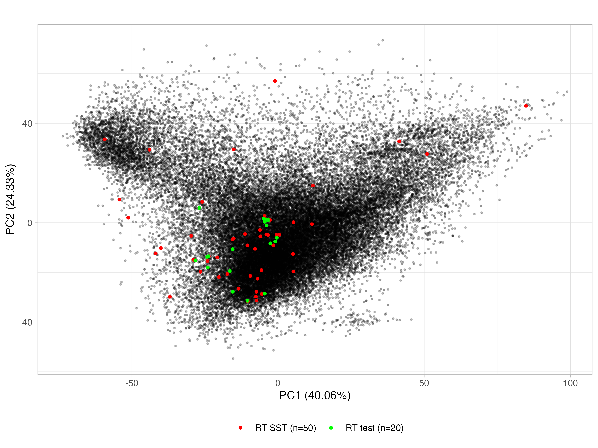
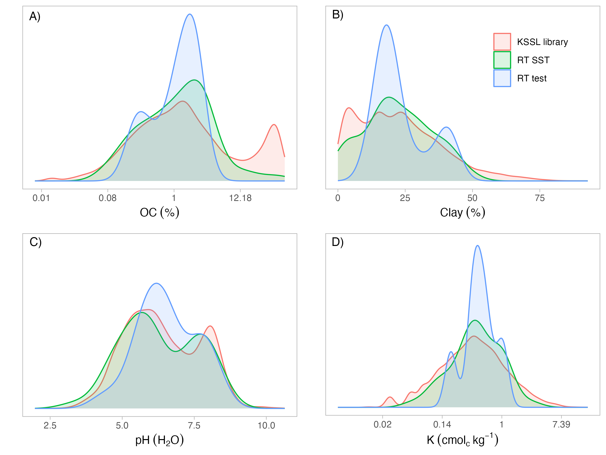

Soil spectroscopy ring trial
================

- <a href="#overview" id="toc-overview">Overview</a>
- <a href="#original-returns" id="toc-original-returns">Original
  returns</a>
- <a href="#formatting" id="toc-formatting">Formatting</a>
- <a href="#preprocessing" id="toc-preprocessing">Preprocessing</a>
- <a href="#spectral-subspace-transformation"
  id="toc-spectral-subspace-transformation">Spectral Subspace
  Transformation</a>
- <a href="#subsets" id="toc-subsets">Subsets</a>

## Overview

Inter-laboratory comparison of soil spectral measurements as part of the
SoilSpec4GG project.

This repository is used for preparing the MIR returns with preprocessing
and spectral standardizaton for further analysis. Spectral harmonization
is ommited to avoid publicly disclosing laboratories information.

The workspace development is defined by:

- GitHub repository:
  [soilspectroscopy/ringtrial-preprocessing](https://github.com/soilspectroscopy/ringtrial-preprocessing)
- Google Cloud storage for efficient file storage and access:
  [whrc.org/soilcarbon-soilspec/storage/sc-ringtrial](https://console.cloud.google.com/storage/browser/sc-ringtrial)

## Original returns

The csv files were downloaded from Google Drive using the `googledrive`
package. Files with `.csv` extension were listed inside MIR returns.
Results, documentation and extra files were discarded. In addition, some
raw files (`.SPA`, `.0`) were converted to `.csv` and uploaded to Google
Drive before formatting to the OSSL specifications.

## Formatting

In order to standardize the spectra to the same unit, scale, and
spectral range, the original returns were formatted to the OSSL
standard:

- Transformed all spectra to apparent absorbance (`A = log10(1/R)`).  
- Trimmed all spectra between 650 and 4000 cm<sup>-1</sup> range.  
- Resampled all spectra to 2 cm<sup>-1</sup> resolution.

## Preprocessing

In addition, all the separated datasets were row-binded and preprocessed
by:

- `raw`: Raw spectra (without preprocessing).  
- `BOC`: Baseline correction (Savitzky–Golay Smoothing \[SGS\]
  `[s=0, p=2, w=11, delta.wav=2]` + Baseline Offset Correction \[BOC,
  i.e., subtracting spectrum minimum\]).  
- `SG1stDer`: SG First Derivative (SG1stDer
  `[s=1, p=2, w=11, delta.wav=2]`).  
- `SNV`: Standard Normal Variate (SGS + SNV).  
- `SNVplusSG1stDer`: SNV followed by SG1stDer.  
- `wavelet`: Wavelet.

## Spectral Subspace Transformation

Spectral space transformation (SST) was applied to correct all RT
instruments’ spectra to a reference instrument (in this case the KSSL).
The RT dataset is relatively small and a previous study demonstrated
that around 50 samples are required to properly use SST, therefore all
the subsequent analysis are employed for a constant test set size of n =
20. The `SNV` spectra were used for SST.

For selecting the 50 samples, Kennard-Stone algorithm was applied on raw
KSSL spectra, compressed by PCA with components retaining 99% of the
cumulative variance (`cumvar = 99.99%`), and distance metric set as
`Mahalanobis`.

``` r
kenStone(X = spec.data.kssl, k = 50, metric = "mahal", pc = 0.9999, .center = T, .scale = T)
```



## Subsets

Probability density distribution of soil properties from KSSL library,
RT SST, and RT hold-out test sets.


